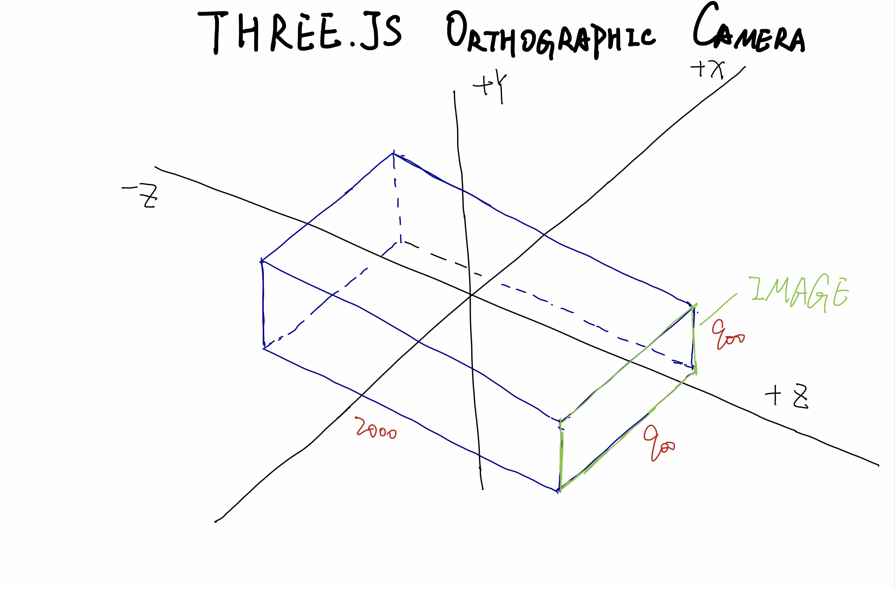
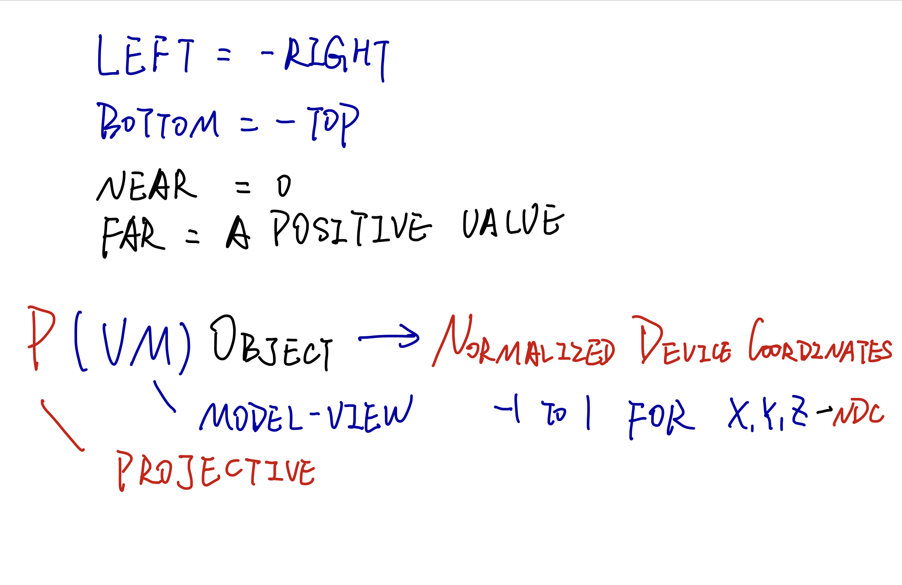
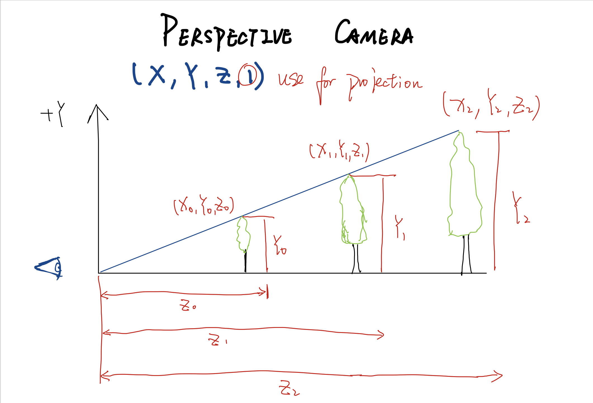
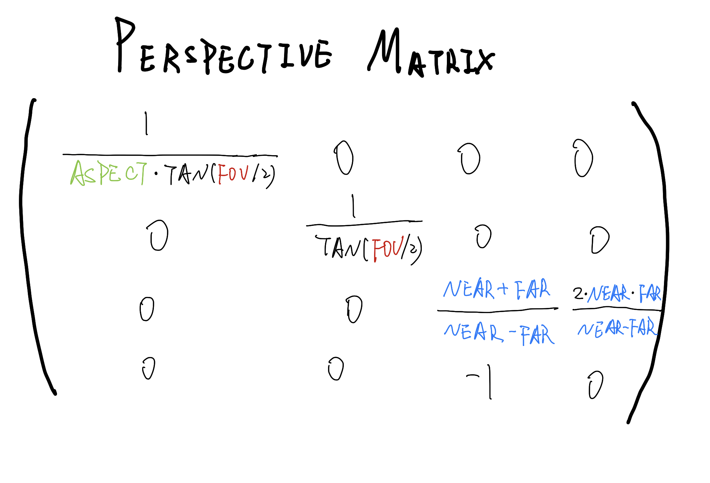
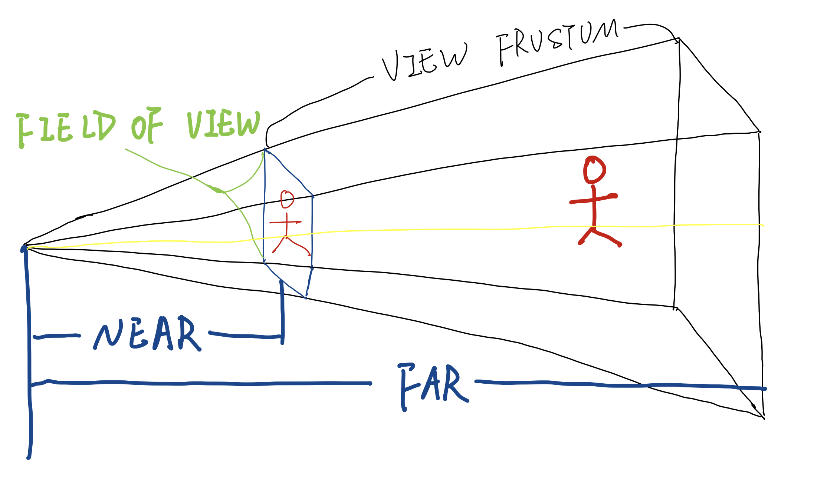
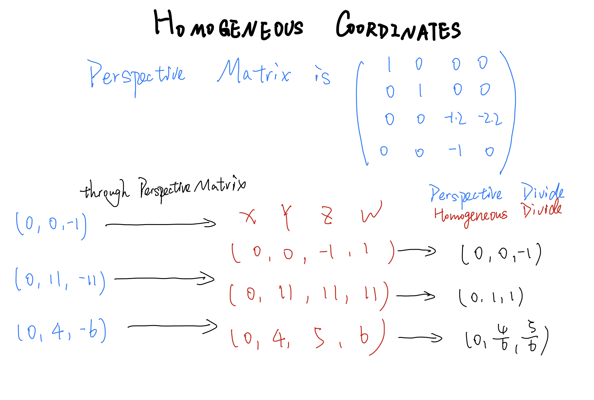
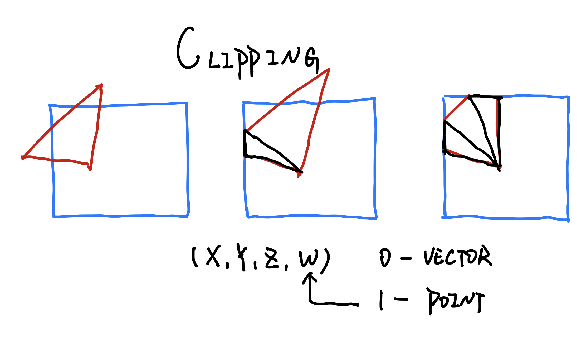
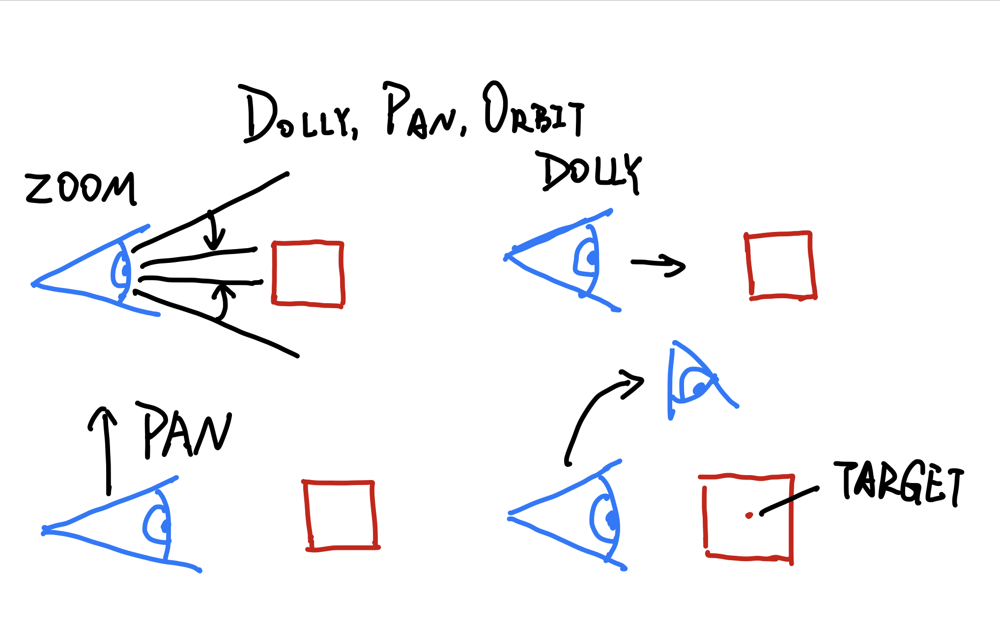
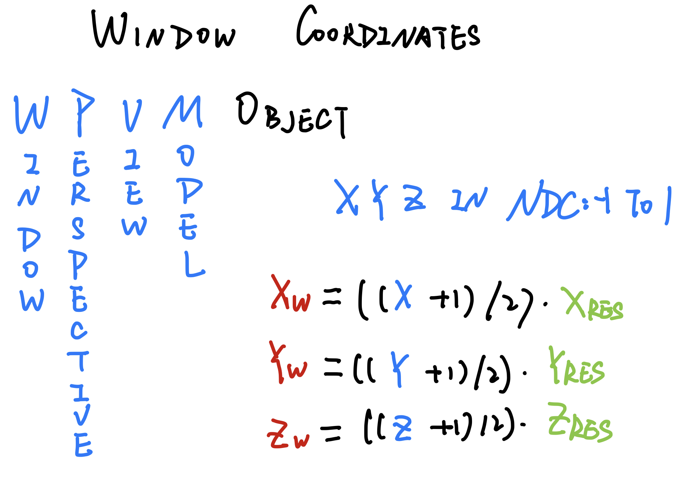

# PROJECTIONS
- fish-eye
- perspective
- orthographic

# ORTHOGRAPHIC CAMERA

# THREE.JS ORTHOGRAPHIC CAMERA
```javascript
var viewSize = 900;
camera = new THREE.OrthographicCamera( 
    -aspectRatio*viewSize / 2, aspectRatio*viewSize / 2, 
    viewSize / 2, -viewSize / 2, 
    -1000, 1000 );
```


# LOOK AT
frame of reference for the camera(照相机的参考系)

# VIEW TRANSFORM

# NORMALIZED DEVICE COORDINATES


# PERSPECTIVE CAMERA
This camera is more like real life, with objects in the distance being smaller. The view matrix is the same as the orthographic camera. But perspective camera is different.


# THREE.JS PERSPECTIVE CAMERA
If you later change the values on the camera itself, such as the field of view near or far planes,  in three.js you need to call camera.updateProjectionMatrix();
in order to have these changes take effect.

# PERSPECATIVE MATRIX



# HOMOGENEOUS COORDINATES


# CLIPPING
Clipping is a step that happens after projection and before division by W. It cutes the segments and triangle edges that poke out through the frustum.


# FIELD OF VIEW(FOV)
When we try to go infinitely far away and have the field of view approaching an angle of zero degree the view becomes an orthographic projection.

# TRUE FIELD OF VIEW


# TARGET

# DOLLY, PAN, ORBIT


# NEAR AND FAR CLIPPING

# DEPHTH OF FIELD

# WINDOW COORDINATES

[view transform pipeline demo](http://www.realtimerendering.com/udacity/transforms.html)  
[opengl transformation pipeline](http://www.songho.ca/opengl/gl_transform.html)  
[GLSL transformation pipeline](https://en.wikibooks.org/wiki/GLSL_Programming/Vertex_Transformations)

# ANTIALIASING(抗锯齿)
MULTISAMPLING(MSAA): cost a lot of memory and computing resources  
two algorithum of antialiasing
- MLAA
- FXAA
```javascript
render = new THREE.WebGLRenderer({ antialias: true });
// turning this on doesn't necessarily do anything. It depends upon whether the GPU supports Anti-aliasing, and whether the browser decides to allow it.
```
# GRAPHICS PIPELINE COORDINATES
starts in: *MODEL COORDINATES* to *WORLD COORDINATES* to *VIEW COORDINATES* to *CLIP COORDINSTES* to *NORMARLIZED DEVICE COORDINATES* to *WINDOW COORDINATES*
