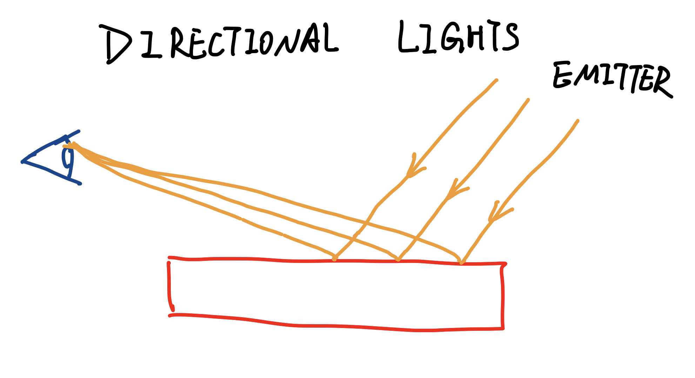

# PHOTONS AS PARTICAL

**  This simple phonton model ignores various  effect such as polarization（偏振） and fluorescence（荧光）**

# DIRECTIONAL LIGHT(like sunlight)

# POINT LIGHT
By default the distance from the light does not effect its brightness. Three.js supports only one drop-off mode, which is to define a maximum distance.

# AMBIENT LIGHT

# SPOT LIGHT
Having direction and you have to point it somewhere. Control of the cone of light it forms is important.
In three.js the only lights capable of casting shadows are spotlights and directional lights. For directional lights, you specify the limits of how wide the light extends.

# DEFERRED RENDEING
To avoid the expense of adding a lot of lights to the scene, we can use deferred rendering. 

# SHADOW MAPPING

whatever the light sees, is what gets lit.

# SHADOW BUFFER LIMITATIONS
- surface acne: 

# RAY TRACING
- The previous light model is called local illumination models, where object is affected by a light, and the result is sent to the eye. So light only from light sources. No light is reflected from other objects.
- Ray tracing can simulate light refelected from other objects. Ray tracing fires rays from the eye through each pixel.

# WHAT PATH ARE IGONRED?
- light -> object -> diffuse object
- light -> mirror -> object

# PATH TRACING
- A path tracing demo [a path tracing demo](http://madebyevan.com/webgl-path-tracing/)

# UMBRA(the fully shaded inner region of a shadow cast by an opaque object) AND PENUMBRA(the partially shaded outer region of the shadow cast by an opaque object)

# HEMISPHERE LIGHTS
- Instead of having a particular position, it's considered to fully surround the scene with light coming from every direction. With hemisphere light, you assign a light color to the top and a different color to the bottom. Each object's normals determine the color of the light it receives from this light source. If the normal points upward, ，light's color is the top color. If the surface normal points straight down, the bottom color. Any direction between gives a blend of these two colors.

# FOG
There are two types of fog in three.js
- Fog(falls off linearly)
- FogExp2(falls off exponentially)