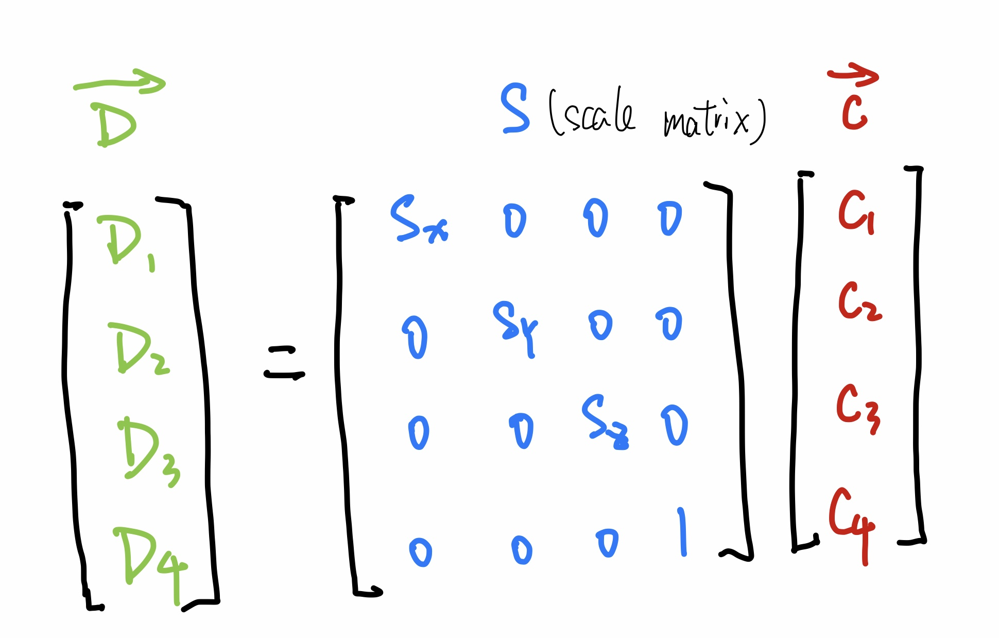
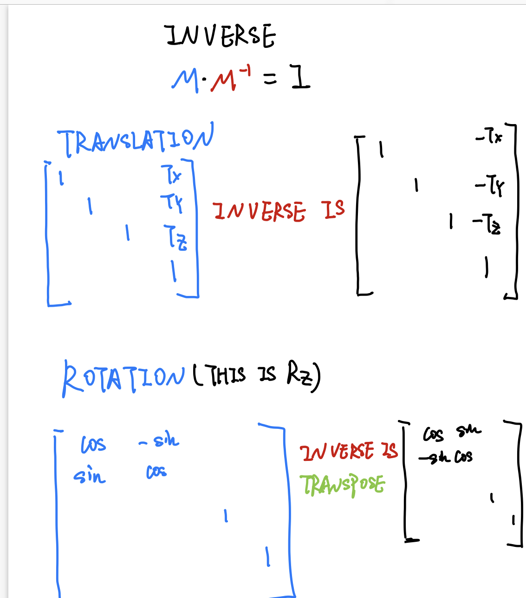
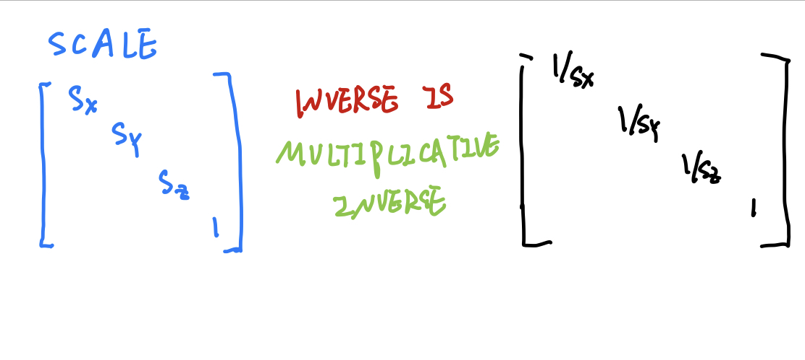
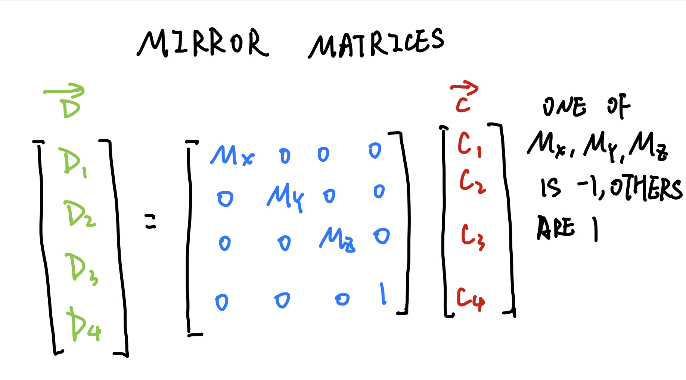
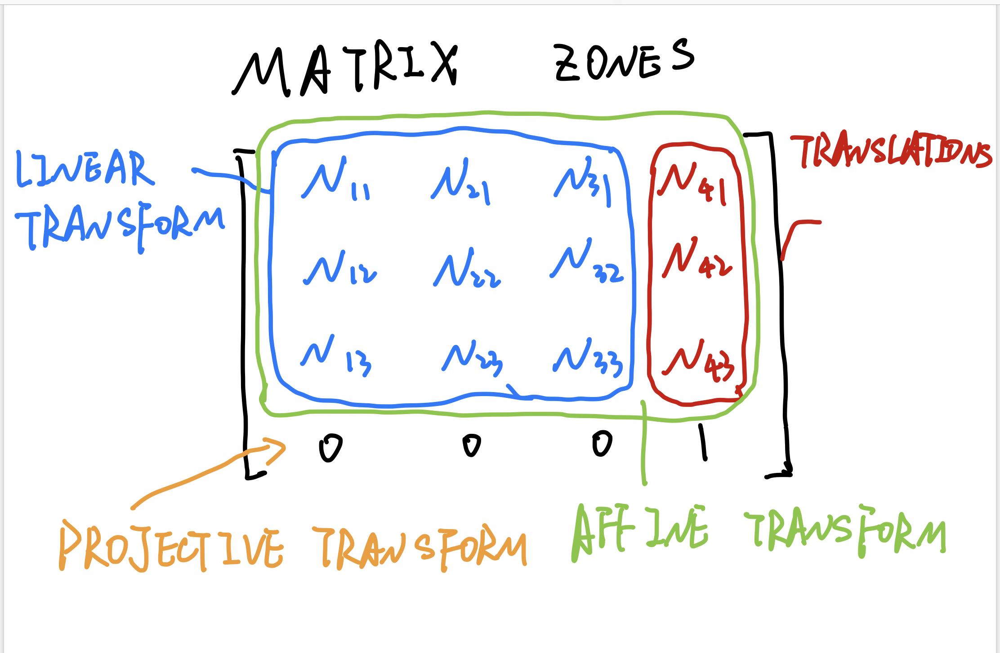
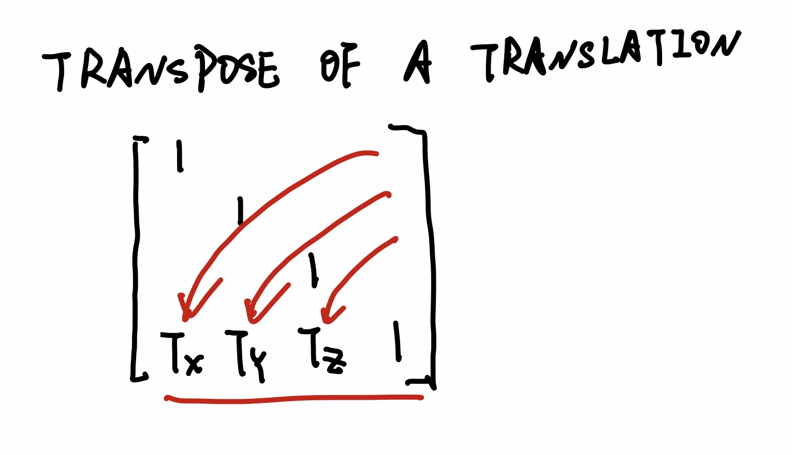

# TRANSLAION MATRIX

** there is the other form called row-major form  **

# USING A MATRIX IN THREE.JS
```javascript
let mtx = new THREE.Matrix4(
    1, 0, 0, 12,
    0, 1, 0, 16,
    0, 0, 1, -5,
    0, 0, 0, 1);
/*
the matrix4 stored like this [1, 0, 0, 0, 0, 1, 0, 0, 0, 0, 1, 0, 0, 0, 0, 1]
*/

// or you can just use
mtx.makeTranslation(x, y, z);
```

```javascript
// apply matrix4D to an object3D
aObject3D.matrix = mtx;
aObject3D.matrixAutoUpdate = false;
```
# ROTATION MATRIX

# FRAMES
Actually I do not understand it, so I can not take the note.

# SCALE MATRIX AND NORMAL

- matrix also transform shading normals, translation and uniformally scale do not influence normal. But non-uniformally scale and rotation change normal's direction.

# TRANSPOSE AND INVERSE



# CORRECT NORMAL TRANSFORMATION
transpose of the inverse of model matrix = inverse of the transpose of model matrix
- TRANSLAN: DON'T CARE
- ROTATION: TRANSPOSE'S INVERSE(the same matrix as model matrix)
- SCALE: 
  - if uniform, just normalize normal
  - if non-uniform, do IT or TI. 

# MIRROR MATRIX


# MATRIX ZONES


# TRANSPOSE OF A TRANSLATION

So it's a projective matrix.

