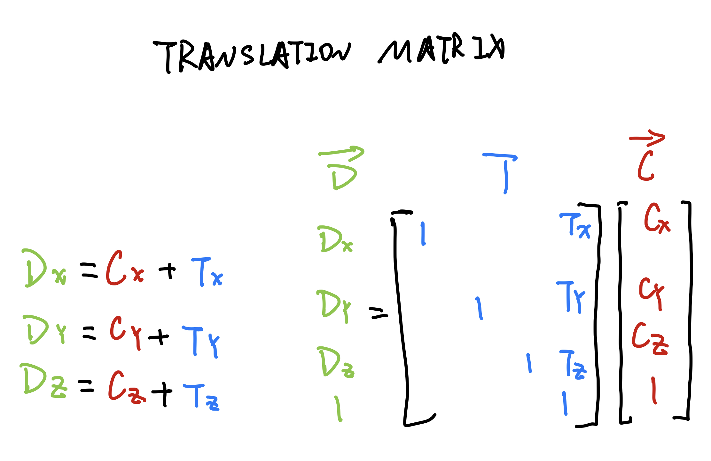

# TRANSLAION MATRIX

** there is the other form called row-major form  **

# USING A MATRIX IN THREE.JS
```javascript
let mtx = new THREE.Matrix4(
    1, 0, 0, 12,
    0, 1, 0, 16,
    0, 0, 1, -5,
    0, 0, 0, 1);
/*
the matrix4 stored like this [1, 0, 0, 0, 0, 1, 0, 0, 0, 0, 1, 0, 0, 0, 0, 1]
*/

// or you can just use
mtx.makeTranslation(x, y, z);
```

```javascript
// apply matrix4D to an object3D
aObject3D.matrix = mtx;
aObject3D.matrixAutoUpdate = false;
```
# ROTATION MATRIX
