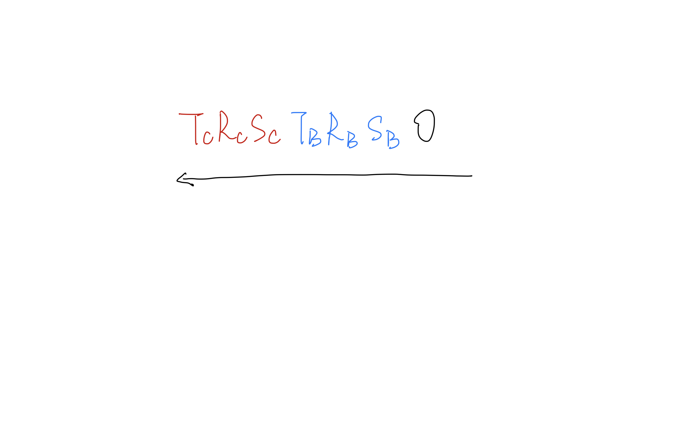

# EULER ANGLES
- X-ROLL AKA. pitch
- Y-ROLL AKA. YAW/HEAD
- Z-ROLL AKA. ROLL  
*** euler angles have the Gimbal Lock promblem. ***

# SCALIING
- NON-UNIFORM SCALING: scale vary. eg. cube.scale.x = 1; cube.scale.y = 0.5; cube.scale.z =1;
- UNIFORM SCALING: does not change any angles within the model itself. eg. cube.scale = new THREE.Vector3(3, 3, 3);

# THE ORDER OF THE OPERATIONS: SCALE, ROTATE, TRANSLATE IN THREE.JS
- the sequence is: scale -> rotate -> translate. So no matter what order you set these parameters, three.js always evaluates them in the order of scale, rotate, translate.

# WHAT HAPPEN IF THE ORDER IS REVERSED
- if translate before rotate the center of the object will not be the origin point, but rotation takes place with respect to the origin. So it might make the position of the object change.

# OBJECT3D
## the order of scale, rotate, translate when mesh is puted into object3d

# HIERARCHY OF OBJECTS
## serious of tranforms I want to apply
1. Once you apply a transform, forget about it.
2. draw a picture!
3. undo if you are not moving towords your goal.

# INSTANCING
- Instancing is the idea that a single geometric set of triangles can be reused again and again. And it can use less memory.

# CAN THESE BE DONE IN ANY ORDER?
|question|true or false|
|-|-|
|series of translations.|Yes|
|series of rotations|No|
|series of scales|Yes|
|rotations & translations along the same axis|Yes|