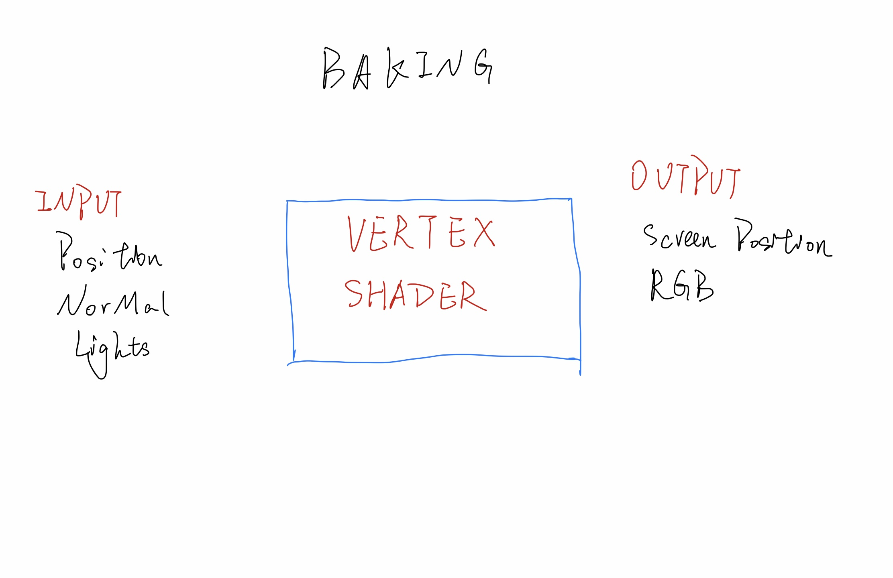

# The programmming pipeline
1. Application
2. Vertex shader
3. Triangle setup
4. Fragment Shader   
5. color&Z-Depth

# color
- Subtractive color: CMYK color
- Addictive color: RGB color 

# A Simple Lighting Model
- Emissive 
- Ambient: a fudge factor to offset the result by the render agorithum do not calculate the light bounced by sround
- Diffuse
- Specular

*** SURFACE COLOR =  EMISSIVE + ABIENT + FOR EACH LIGHT: DIFFUSE(LIGHT) + SPECULAR(LIGHT, VIEW)  ***
C = E + A + Σ(D(L) + S(L, V))

# Diffuse Material
## How to do in three.js
- change MeshBasicMaterial to MeshLambertMaterial
- formular: C = AMBIENT + COLOR•Σ(Vector(N)•Vector(Li))

# Shading Normal vs. Geometric Normal

# Ka, Kd and HSL
*** FRAGMENT COLOR = Ka • MATERIAL + Kd • MATERIAL•(vector(N)•vector(L))  ***

# Baking

- Only if the lights' directions and object orientation do not change can use baking.

# Specular Material
## One formular to simulate specular materials: BLING-PHONG REFLECTION MODEL
SPECULAR = MAX(Vector(N)•Vector(H), 0)S  
In the formula the N is the surface normal, and H is called half angle vector.

# Gouraud Shading
- Mach Bands: sharp shading changes

# PHONG SHADING(PER-PIXEL SHADING) VS. GOURAUD SHADING(PER-VERTEX SHADING)
phong shading cost more computation resources but more accurate to show the specular highlight.

# TRANSPARENT MATERIAL
## TWO PHENOMENONS
- REFRACTION
- CAUSTICS
## BLENDING
- Screen-door transparency(not so general)
- The over operator. formular to calculate it: *** C = $\alpha$s * Cs + (1 $\alpha$s * CD) ***  (Cs means the color of the source, CD means the color of the destination)

# THE Z-BUFFER AND TRANSPARENCY
- The traditional z-buffer way can not calculate tansparency.
## TWO WAYS TO CALCULATE THE Z-BUFFER WITH TRANSPARENCY
- DRAW ALL OBJECTS SORTED BACK TO FRONY ORDER
- DRAW THE FULLY OPAQUE OBJECTS FIRST, TRANSPARENT LATER
##  TRANSPARENCY AND TREE.JS
- render all opaque object first, z-buffer on
- turn on blending
- render transparent objects sorted from back to front
## PROBLEMS TO RENDER TRANSPARENCY (link:https://classroom.udacity.com/courses/cs291/lessons/91376562/concepts/1035307660923) do not have enough time to take all notes
- interpenetrate transparent objects' cross part will not blending 
- back face will not shown for any transparent objects. If turn back face on will get strange rendering effects.

# RAY TRACING ALGORITHM SOLVES TRANSPARENCY ISSUES DIRECTLY