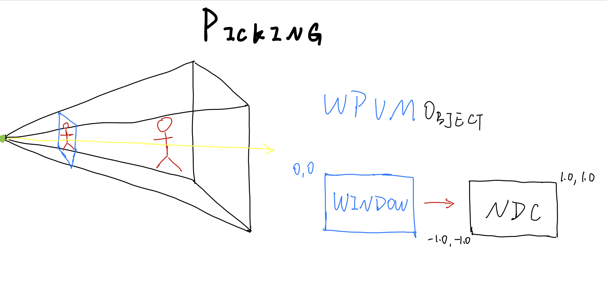

# Introduction

# Events
```js
function onDocumentMouseDown( event ) {
    var mouseVector = new THREE.Vector3(
        2 * ( mouseX / canvasWidth ) - 1,
        1 - 2 * ( mouseY / canvasHeight ));
    var projector = new THREE.Projector();
    var raycaster = projector.pickingRay( mouseVector.clone(), camera );
    var intersects = raycaster.intersectObjects( objects );

	if ( intersects.length > 0 ) {

		intersects[ 0 ].object.material.color.setRGB( Math.random(), Math.random(), Math.random() );

		var sphere = new THREE.Mesh( sphereGeom, sphereMaterial );
		sphere.position = intersects[ 0 ].point;
		scene.add( sphere );
	}
}
```


# Dragging

# The Rendering Loop

# Incremental Animation

