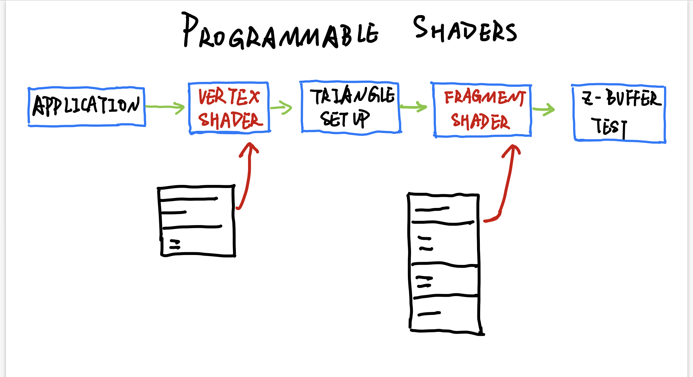
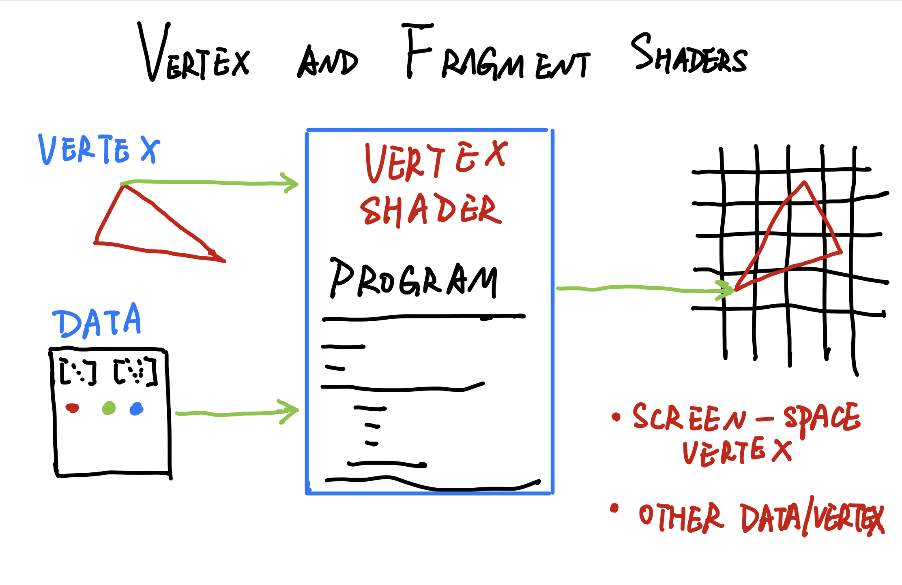
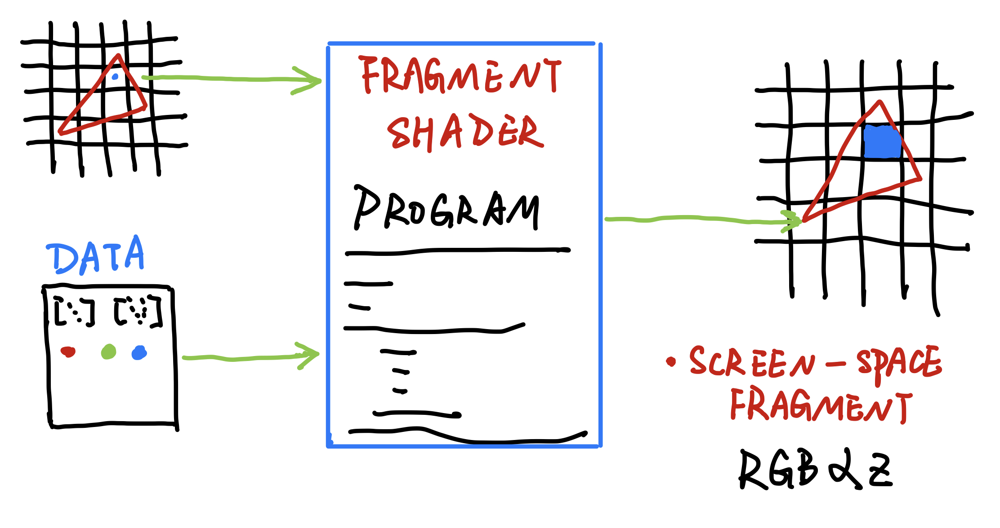

# PROGRAMMABLE SHADERS

# COMPUTE CHIP DESIGN CHALLENGES

# VERTEX AND FRAGMENT SHADERS

  
Morden GPUs use what is called a unified shader in the hardware itself. These shader processors are assigned on the fly by the GPUs, to excute vertex shader or fragment shader programs, depending on where the bottleneck is found.

# SHADER ARCHITECTURE

# SHADER INPUTS

# GLSL ES
