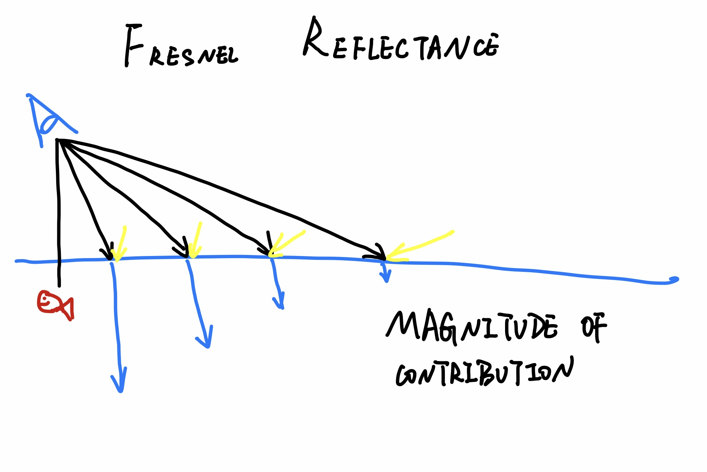
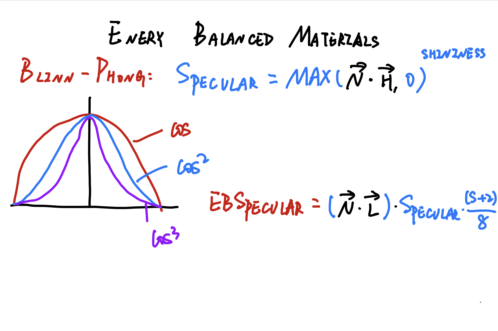

# PROGRAMMABLE SHADERS

# COMPUTE CHIP DESIGN CHALLENGES

# VERTEX AND FRAGMENT SHADERS

  
Morden GPUs use what is called a unified shader in the hardware itself. These shader processors are assigned on the fly by the GPUs, to excute vertex shader or fragment shader programs, depending on where the bottleneck is found.

# SHADER ARCHITECTURE

# SHADER INPUTS

# GLSL ES

# Vertex Shader Example

# Fragment Shader Example

# NON-PHOTORELISTIC RENDERING
# AKA
- TOON SHADING
- CEL SHADING
- POSTERIZATION  
[further reading](https://medium.com/cbrebuild/implementing-a-sketch-style-of-rendering-in-webgl-d6f0e4685a17)  

*Transparency causes the most problems for the cel shader.*

# VERTEX SHADER PROGRAMMING

# DEBUGGING SHADERS
[good question of how to debug webgl and canvas](https://stackoverflow.com/questions/56892842/canvas-webgl-debugging-functionality-does-not-exist-in-2019-browser)

# FRESNEL REFLECTION

# ENERGY BALANCED MATERIALS

# PHYSICALLY-BASED MATERIALS

# BSDF AND BSSRDF
