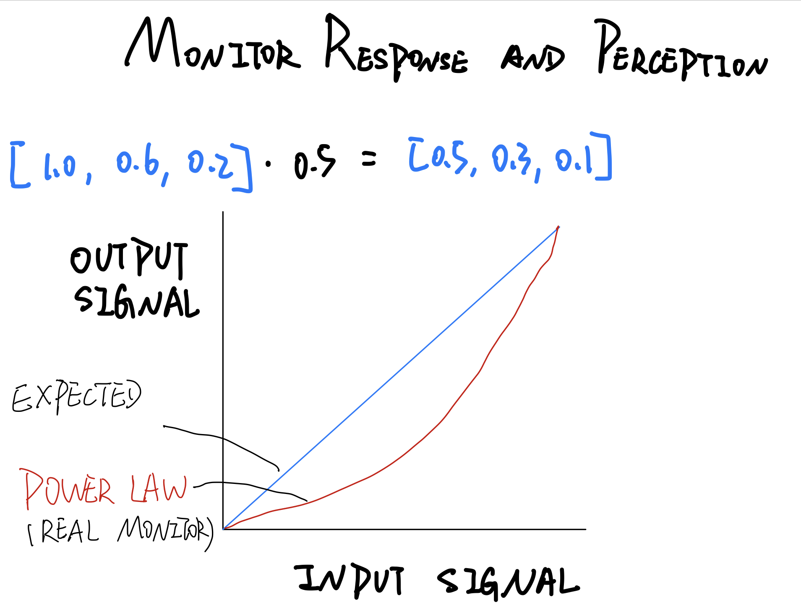

# PROGRAMMABLE SHADERS

# COMPUTE CHIP DESIGN CHALLENGES

# VERTEX AND FRAGMENT SHADERS

  
Morden GPUs use what is called a unified shader in the hardware itself. These shader processors are assigned on the fly by the GPUs, to excute vertex shader or fragment shader programs, depending on where the bottleneck is found.

# SHADER ARCHITECTURE

# SHADER INPUTS

# GLSL ES

# Vertex Shader Example

# Fragment Shader Example

# NON-PHOTORELISTIC RENDERING
# AKA
- TOON SHADING
- CEL SHADING
- POSTERIZATION  
[further reading](https://medium.com/cbrebuild/implementing-a-sketch-style-of-rendering-in-webgl-d6f0e4685a17)  

*Transparency causes the most problems for the cel shader.*

# VERTEX SHADER PROGRAMMING

# DEBUGGING SHADERS
[good question of how to debug webgl and canvas](https://stackoverflow.com/questions/56892842/canvas-webgl-debugging-functionality-does-not-exist-in-2019-browser)

# FRESNEL REFLECTION

# ENERGY BALANCED MATERIALS

# PHYSICALLY-BASED MATERIALS

# BSDF AND BSSRDF

# MONITOR RESPONSE AND PRECEPTION

## problems

- lights do not add up correctly
- the hue of colors can shift
- antialiasing won't look as good
- mipmapped textures will appear dimmer in the distance

# GAMMA CORRECTION(to fix the previous problems)
- compute our renderings in a linear space
- compensate for the power curve of monitors

**display cannel value** = (**computed channel value**)1/gamma (usually gamma value is 2.2)  
eg. (1.0, 0.793, 0.481) = (1.0, 0.6, 0.2)1/2.2

# GAMMA DEMO
If you want to reproduce the demo please use the r56 version webpack, because there are lots of apis have been deprecated. And I have't fix it yet.