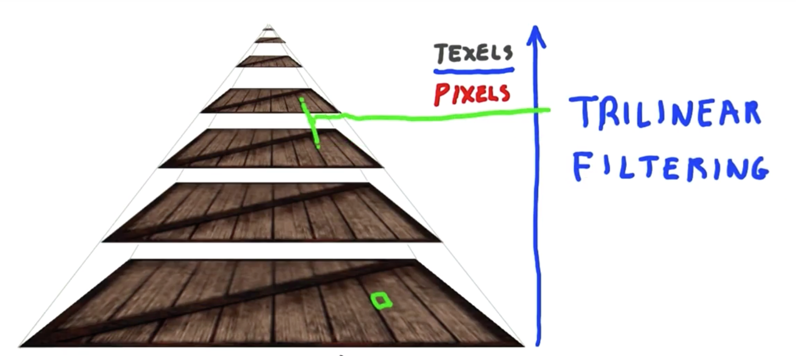
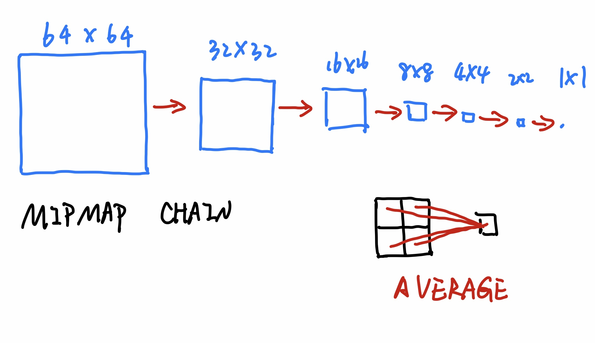
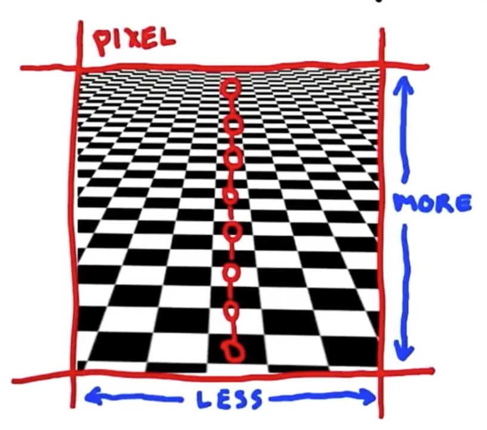
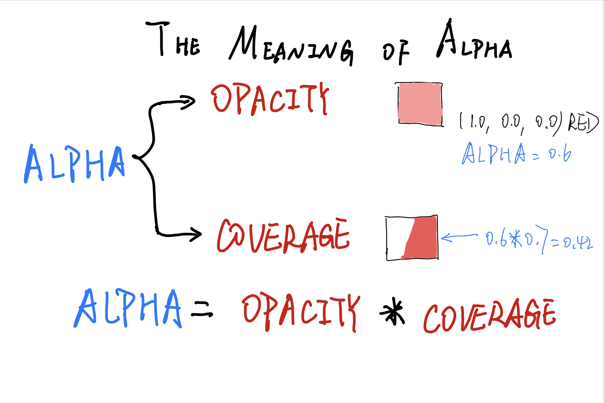
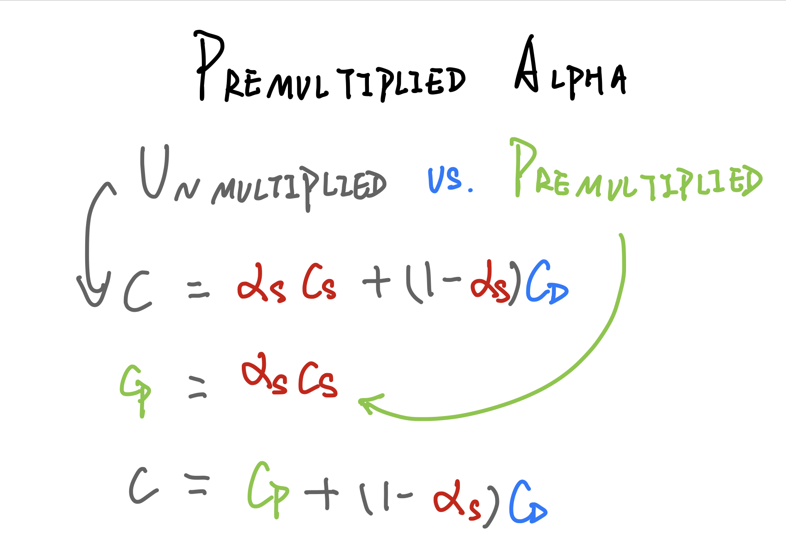

# HOW TEXTURE WORK

WebGL do not allow to load cross-domin images into WebGL texture. You can use CORS or JSONP or reverse proxy etc. to solve this problem.

# TEXTURE UVs


# UVs in three.js
```javascript
// example: making a triangle with UVs code
let geo = new THREE.Geometry();

// generate vertices
geo.vertices.push( new THREE.Vector3(0.0, 0.0, 0.0) );
geo.vertices.push( new THREE.Vector3(4.0, 0.0, 0.0) );
geo.vertices.push( new THREE.Vector3(4.0, 4.0, 0.0) );

let uvs = [];
uvs.push( new THREE.Vector2(0.0, 0.0) );
uvs.push( new THREE.Vector2(1.0, 0.0) ); 
uvs.push( new THREE.Vector2(1.0, 1.0) ); 

// generate faces
geo.faces.push( new THREE.Face3(0, 1, 2) );
geo.faceVertexUVs[0].push(  [uvs[0], uvs[1], uvs[2] ] );
```

# TEXTURE MAPPING
Objects with UVs and textures can be imported into three.js. [webgl_loader_md2_control demo](https://threejs.org/examples/#webgl_loader_md2_control)   
  
The way in which a model is associated with its texture is called texture mapping. The spheres and other objects we saw before had fairly natural projections of the texture onto their surfaces. For a more complex object, such as this humanoid, an artist uses a modeling program to assign the parts of the texture to the model. When a triangle mesh has a texture applied to it the texture is used by the whole mesh. Because of this, a single texture is used to hold all the different images for the various parts of the mesh. This kind of texture is called a texture atlas or a mosaic.

# TEXTURE DISTORTION
## Some further reading
[Its-Really-Not-a-Rendering-Bug-You-se](https://www.geekshavefeelings.com/x/wp-content/uploads/2010/03/Its-Really-Not-a-Rendering-Bug-You-see....pdf)  
[limits-of-triangles](http://www.realtimerendering.com/blog/limits-of-triangles/)  
Though I do not have enough time to read them. Orz

# WRAP MODES
- repeat: If you want to have things look continuous, such as water, then the texture itself needs to be what is called seamless, where its edges mach up.
- mirrored repeat: If your texture is not seamless, one cheap way to tile it accross the plane is to set the wrap mode to be mirrored repeat.
- clamp to edge: The pixels on the edge are used to fill in the area.
```javascript
// set wrap mode in three.js
let texture = new THREE.Texture();
texture.wrapS = texture.wrapT = THREE.RepeatWrapping;
texture.wrapS = texture.wrapT = THREE.MirroredRepeatWrapping;
texture.wrapS = texture.wrapT = THREE.ClampToEdgeWrapping;
```
## An example
[relative path of the demo](../exercises/src/examples/wrap-mode.js)

# TEXTURE TRANSFORM
  
This is a bit intrusive, you have to modify the geometric mesh itself.
## alternate solution in three.js
```javascript
let texture = new THREE.Texture();
texture.repeat.set(1, 1); // how many times a texture should repeat across the surface.
texture.offset.set(0, 0); // Offset is a translation adding to the uv coordinate after scaling.
```

# TEXTURE MAGNIFICATION
## METHODS OF SAMPLING THE TEXTURE
- nearest neighbor: Whatever texel center is closest to the pixel center, is the color the pixel gets.
- bilinear interpolation: It takes the four closest texel centers and interpolates among them.
```javascript
// in three.js how to set to use these two methods
let texture =  new THREE.Texture();
texture.magFilter = THREE.NearestFilter;
texture.magFilter = THREE.LinearFilter; // avoid texels cover a lot of pixels
```


# SMOOTH TO SHARP
When improving the resolution of the image the edges jump from smooth to sharp. It is because 
- Minification is occorring
- Linear interpolation is no longer being used
- On average, each pixel covers more than one texel
- The magfilter no longer applies

# MINIFICATION
Minification causes two problems. First one is, for a high resolution checker texture, it simply causes the edges to become sharp. And the other one is that the far part of infinite checkerborder will be noise. The problem is that each pixel in the distance covers a few texels. As we get closer and closer to the horizen, the number of texels per pixel increases. When the fragment shader looks up what's in the texture, it gets whatever texel happens to be at the center of the pixel. At the horizon, this selection is almost random, so we get noise as we very between white and black texels.
[relative path of the demo](../exercises/src/examples/texture-minification.js)

# MIPMAPPING
The GPU has built into a special functionality that implements an algorithm called mip-mapping. With mip-mapping the GPU computes approximately what the texel to pixel ratio is. If this ratio is less than one Magnification happens and the mag-filter takes effect. If this ratio is greater than one, minification is happening.
  


# ANISTROPY
# ANISOTROPIC SAMPLING
*Anisotropic*: means having a different value in different directions.
*Sampling*: means retrieving some pieces of information meant to represent the whole.
  

# SAMPLING AND FILTERING
```javascript
let texture = new THREE.Texture();
texture.magFilter = THREE.NearestFilter;
texture.magFilter = THREE.LinearFilater; // the norm

texture.minFilter = THREE.NearestFilter;
texture.minFilter = THREE.LinearFilater;
texture.magFilter = THREE.LinearMipMapLinearFilter; // the norm

texture.anisotropy = 1; // does not exist on older GPUs
texture.anisotropy = renderer.getMaxAnisotropy();
```
[sampling&filtering example](../exercises/src/examples/anisotropy.js)

# TRANSPARENCY MAPPING
To make a transparency mapping you need a texture with alpha. Usually its PNG form.


# THE MEANING OF ALPHA
  
I should note that alpha truly stands for the product of opacity and coverage. Be careful not to think of alpha as just one or the other, because it's always their product. For example, if your texture was semitransparent and had an alpha of 0.8, and a particular pixel was covered by 0.3 of the textured polygon (and you could compute this), you would multiply these two together to get a final alpha, 0.24.  

# PREMULTIPLIED ALPHA


# PRITICLES AND BILLLBOARDS

# MAKING PARTICALES
```javascript
// making particles in three.js
let disk = THREE.ImageUtils.loadTexture('pathToYourTexture');
let material = new THREE.ParticleBasicMaterial( // use this material to make texture always facing towards us
    { 
        size: 25, 
        sizeAttenuation: false, // set false to make each particale to have constant size on the screen
        map: disk, 
        transparent: true 
    }
);
material.color.setHSL(0.9, 0.2, 0.6);

let particles = new THREE.ParticleSystem(geometry, material);
particles.sortParticles = true; // this means we want the particles in the system to be sorted with respect to the camera's view
scene.add(particles);
```
[example](../exercises/src/examples/particales.js)  

# DISPLACEMENT AND NORMAL MAPPING
I do not understand this chapter though I've learned it for many times.
- displacement mapping
- 

# LIGHT MAPPING

# AMBIENT OCCLUSION(AO)

There is a class of algorihums for interactive rendering called screen space ambient occlusion or SSAO.

# REFLECTION MAPPING

# GLOSSY REFLECTION